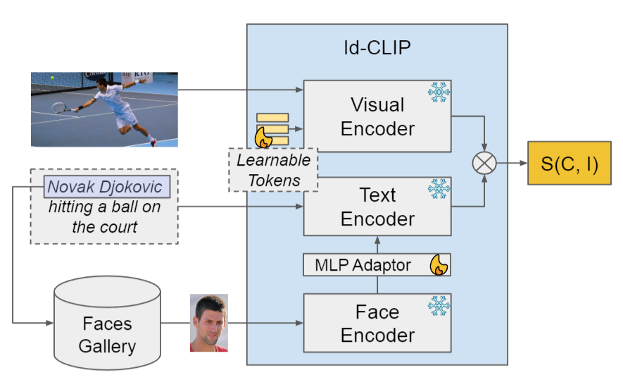
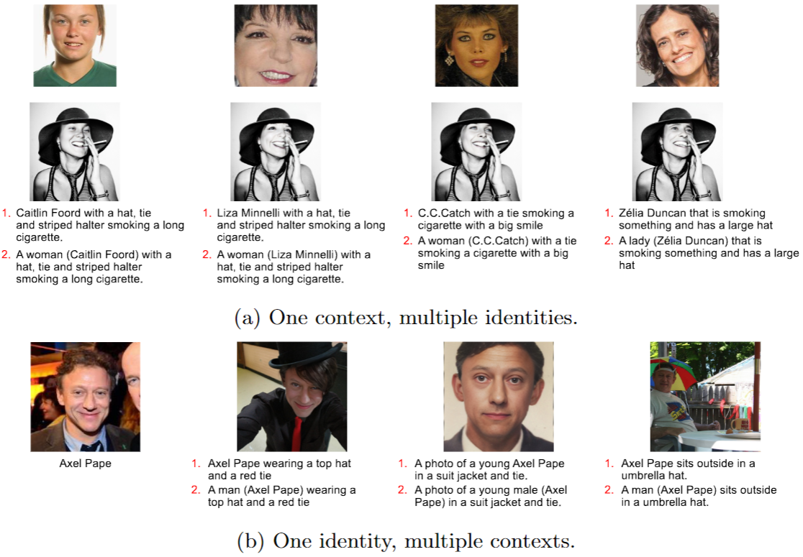

# Towards Identity-Aware Cross-Modal Retrieval: a Dataset and a Baseline

Official implementation of the paper "Towards Identity-Aware Cross-Modal Retrieval: a Dataset and a Baseline", accepted at [ECIR 2025](https://ecir2025.eu/).

<table>
    <tr>
        <td></td>
        <td></td>
    </tr>
    <tr>
        <td>Our Baseline Model</td>
        <td>Samples from the COCO Person Faceswap Dataset</td>
    </tr>
</table>


## Introduction

This repository contains the official implementation of our ECIR 2025 paper. The paper introduces a novel dataset and a baseline for identity-aware cross-modal retrieval. Our approach aims to improve retrieval performance by incorporating identity information into the retrieval process, by conditioning a properly-finetuned [CLIP](https://github.com/openai/CLIP) model with the person's face.

## Citation

If you use this code or dataset in your research, please cite our paper: TODO

## Getting Started

To get started, follow the instructions below:

1. **Clone the repository:**
    ```bash
    git clone https://github.com/mesnico/IdCLIP
    cd IdCLIP
    ```

2. **Install the required dependencies:**
    ```bash
    pip install -r requirements.txt
    ```

3. **Download the dataset:**
    The dataset can be downloaded from this [Zenodo link](#). Since the images contain deepfakes of known persons and may therefore violate privacy policies, the data is only available for research purposes in restricted mode (i.e., an explicit access request has to be pursued through the provided Zenodo link). 
    
    Notice that modified captions are not part of the dataset, since they are modified on-the-fly during the dataloading procedure used both at training and test time. In the near future, we will dump these captions on file and add them to the dataset so to make it more self-contained.

    *Important*: the data folder should be set by properly modifying the `datadir` entry in `configs/data/coco_faceswap_5_entities.yaml`.


## Training

To train the model, run the following command:
```bash
bash train.sh
```
You can adjust and explore different training parameters by properly editing the `train.sh` file, by following the configurations present within the `config` folder.

The tensorboard log files and the checkpoints will be saved by default under the `runs` folder. From this folder, you can access all the experiments generated by all the selected configurations.

## Evaluation

To evaluate the trained model, use the following command:
```bash
bash train.sh
```
If you modified `train.sh` file, you then will have to also edit appropriately the `retrieval.sh` file so that it contains the same configurations used at training time.

The evaluation results will be saved under the experiment path under `runs`, under the `inference` directory.

The metrics can be collated and visualized in tabular form by running the `show.ipynb` python notebook.

## Acknowledgements

This work was partially funded by MUCES - a MUltimedia platform for Content Enrichment and Search in audiovisual archive project (CUP B53D23026090001), and by PNRR-M4C2 (PE00000013) "FAIR-Future Artificial Intelligence Research" - Spoke 1 "Human-centered AI", funded under the NextGeneration EU program.